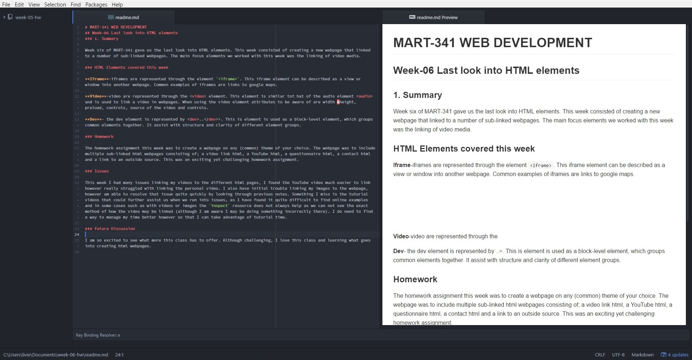

# MART-341 WEB DEVELOPMENT
## Week-06 Last look into HTML elements
### 1. Summary

Week six of MART-341 gave us the last look into HTML elements. This week consisted of creating a new webpage that linked to a number of sub-linked webpages. The main focus elements we worked with this week was the linking of video media.

### HTML Elements covered this week

**Iframe**-iframes are represented through the element `<iframe>`. This iframe element can be described as a view or window into another webpage. Common examples of iframes are links to google maps.

**Video**-video are represented through the <video> element. This element is similar tot hat of the audio element <audio> and is used to link a video in webpages. When using the video element attributes to be aware of are width &height, preload, controls, source of the video and controls.

**Dev**- the dev element is represented by <dev>..</dev>>. This is element is used as a block-level element, which groups common elements together. It assist with structure and clarity of different element groups.

### Homework

The homework assignment this week was to create a webpage on any (common) theme of your choice. The webpage was to include multiple sub-linked html webpages consisting of; a video link html, a YouTube html, a questionnaire html, a contact html and a link to an outside source. This was an exciting yet challenging homework assignment.

### Issues

This week I had many issues linking my videos to the different html pages, I found the YouTube video much easier to link however really struggled with linking the personal video. I also have initial trouble linking my images to the webpage, however am able to resolve that issue quite quickly by looking through previous notes. Something I miss is the tutorial videos that could further assist us when we run into issues, as I have found it quite difficult to find online examples and in some cases such as with videos or images the `inspect` resource does not always help as we can not see the exact method of how the video may be linked (although I am aware I may be doing something incorrectly there). I do need to find a way to manage my time better however so that I can take advantage of tutorial time.

### Future Discussion

I am so excited to see what more this class has to offer. Although challenging, I love this class and learning what goes into creating html webpages.

### Screenshot

.
